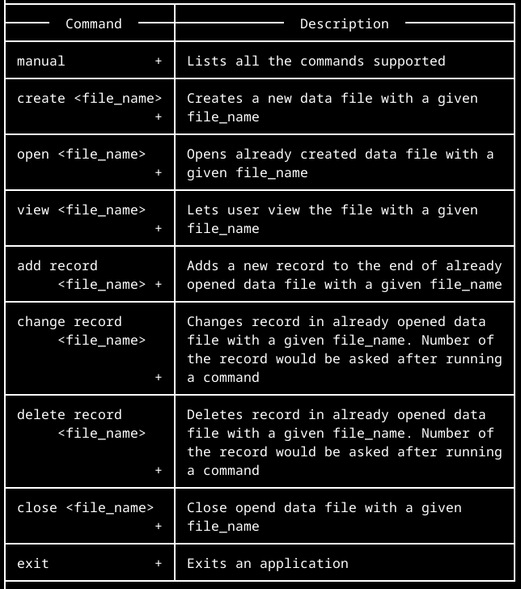
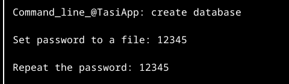
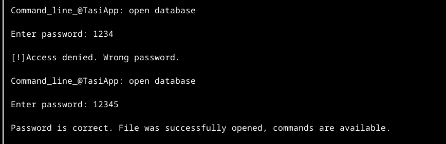
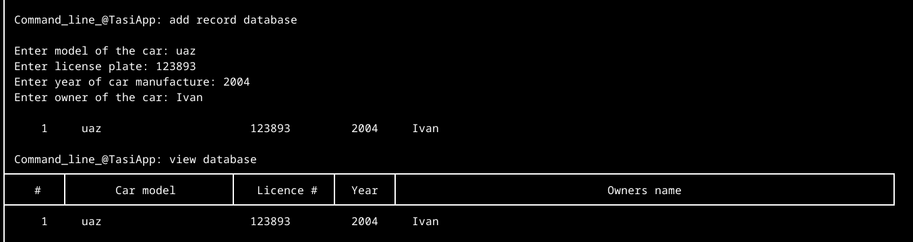
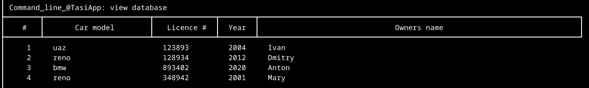
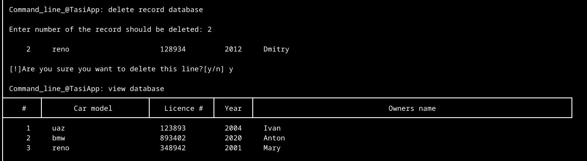

# Assembly | learning

This repository contains my learning test programms and the project I made to clarify my knowledge.

# TasIApp

A program to manage simple text databases.

## **You can:**
- Create database;
- Open database;
- Set password on the database file;
- View database;
- Add record to the database;
- Change record in the database;
- Delete record from the database. There is a prompt message to prevent you from deleting the wrong line;
- Close database;
- Exit the program.

## Examples
#### Menu

#### Creating database

#### Opening database

#### Adding record to the database

#### Deleting record in the database

Database contents before delinig a record:

Deleting the second record from the database
